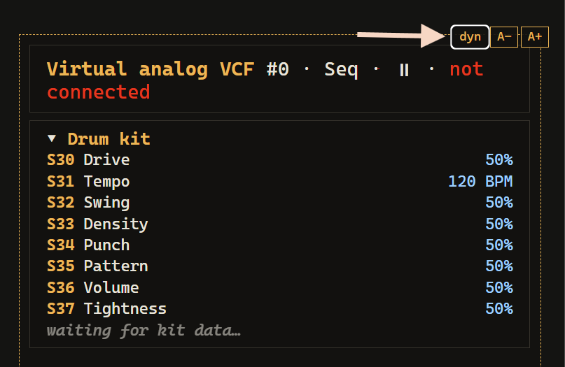

# TouchPlaited — Controls Reference

> **Tip:** the [visualizer webapp](https://jonwaterschoot.github.io/TouchPlaited/visualizer/) shows all of this live on a drawing of the panel while you play — see [Visualizer webapp](#visualizer-webapp) below.

## Controls at a glance

### Basic Pitch (SW2 Down)

| Control | Function | MIDI CC |
|---------|----------|---------|
| S30 | Drive | 24 |
| S31 | Decay | 23 |
| S32 | Harmonics | 20 |
| S33 | Timbre | 21 |
| S34 | Morph (no effect on engines 2–4 and 19–23) | 22 |
| S35 | — *(only active with P0/P2 held)* | — |
| S36 | Output level | 26 |
| S37 | Model mix — OUT↔AUX blend | — |
| — | LPG colour (no knob) | 25 |
| SW1 | Scale: minor (left) / chromatic (center) / major (right) | — |
| P3–P9 | Play notes | notes in, ch 1 |
| P10 / P11 | Octave down / up | — |
| **Hold P0 (shift)** | | |
| P0 + S35 | Model select, bank 0 (engines 0–11) | — |
| P0 + S37 | Stereo width | — |
| P0 + P10 / P11 | Root semitone down / up | — |
| P0 + P2 hold 2 s / 4 s / 6 s | Randomize tight / randomize wide / back to clean | — |
| **Hold P2 (shift)** | | |
| P2 + S35 | Model select, bank 1 (engines 12–23) | — |
| P2 (hold) + P10 | Melodic transport — arp + Rec loop run / stop | — |
| P2 (hold) + P11 | Drum seq play / pause | Start/Continue/Stop |
| **Hold P1 (FX shift)** | | |
| P1 + S30 | Reverb (pitched voices) — center = off; left half = room, right half = hall; wet grows outward | — |
| P1 + S35 | Delay (pitched voices) — center = off; left half = slapback, right half = synced dotted 1/8 | — |

### Arp/Mel (SW2 Center)

SW1 picks the sub-state — **Hold** (left) · **Arp** (center) · **Rec** (right) — change-latched like scale/genre: it takes effect only when flicked *while in the mode*. The knobs shape the arp in Arp/Hold; **S32–S35 switch to Rec-only functions while SW1 is in Rec** (Speed/Shift/Chance/Order instead of Division/Swing/Density/Order). Basic Pitch, the arp and Rec each have their **own** volume, drive, blend, FX send, octave and sound model (21/07/26 follow-up) — nothing here is shared with Basic Pitch or between Arp/Hold and Rec. Width alone stays shared across all three.

| Control | Function (Arp / Hold) | Function (Rec) | MIDI CC |
|---------|------------------------|-----------------|---------|
| S30 | Drive — live, applied to every arp trigger; **own value, independent of Rec's** | **own value**, independent of Arp's | 24 (Basic Pitch only) |
| S31 | Decay — live on the arp; stamped per note into a Rec take; shared knob, same meaning in both | same | — |
| S32 | Division — 1/4 · 1/8 · 1/8T · 1/16 · 1/16T · 1/32 (center = 1/16) | **Speed** — 1x (left) to 8x (right) playback rate of committed layers; live recording stays real-time | — |
| S33 | Swing — delays odd arp steps, up to 50% of the division | **Shift** — moves committed layers in time, up to a full loop either way (center = no shift) | — |
| S34 | Density — Euclidean fill: upper half steady 0–100%, lower half the same sweep with a 75% chance roll | **Chance** — per-hit playback probability, rolled fresh every pass (right = always) | — |
| S35 | Order — played / up / down / ping-pong / random (default) | **Order** — left of center = as recorded, right = pitches shuffled across committed events (rhythm untouched) | — |
| S36 | Output level — **own value per sub-state** | **own value** | 26 (Basic Pitch only) |
| S37 | Blend — **own value per sub-state**; hold P0: stereo width, which stays shared | **own value** | — |
| SW1 | Sub-state: Hold (left) / Arp (center) / Rec (right) | — | |
| P3–P9 | Arp: feed the pool while held · Hold: latch, re-touch removes | Rec: play + record; **hold P2 + a pad, see below, for layer gestures** | notes in, ch 1 |
| P10 / P11 | Base octave − / + — **own octave per sub-state** (Arp/Hold vs Rec) | | — |
| **Hold P0 (shift)** | | | |
| P0 + P10 / P11 | Octave range − / + (0–3 extra octaves the arp climbs) | | — |
| P0 + S35 | Model select, bank 0 — on the arp's sound (Arp/Hold) or Rec's own sound (Rec) | | — |
| P0 + S37 | Stereo width | | — |
| P0 + P1 hold 1 s | **Sound edit** toggle — knobs become S30 drive · S31 decay · S32 harmonics · S33 timbre · S34 morph on whichever sound is in view (arp's own in Arp/Hold, Rec's own in Rec); functions freeze until toggled back | | — |
| P0 + P2 hold 2 s / 4 s | Vary the in-view sound — tight / wide | | — |
| **Hold P1 / P2 (shift)** | | | |
| P1 + P10 | *(Rec only)* Undo layer | | — |
| P1 + S30 / P1 + S35 | Reverb / delay send — **own send per sub-state** | | — |
| P2 + S35 | Model select, bank 1 — same in-view-sound rule as P0+S35 | | — |
| P2 + pad P3–P7 (Rec only) | Tap = mute/unmute that layer · hold = clear that layer · hold ≥2 pads = clear all layers | | — |
| P2 (hold) + P10 | Melodic transport — arp run / stop (any playmode) · **in Rec: cycles capturing → looping → stopped (see below)** | | — |
| P2 (hold) + P11 | Drum seq play / pause | | Start/Continue/Stop |

### Seq (SW2 Up)

| Control | Function | MIDI CC |
|---------|----------|---------|
| S30 | Drive — also rides the kick's punch (extra timbre push on trigger) | 24 |
| S31 | Tempo (60–180 BPM) | 27 (muted by ext. clock) |
| S32 | Shuffle | 28 |
| S33 | Pattern density (layer 4 … layers 1-4) | 29 |
| S34 | Step chance — scales each step's own authored chance; center = as authored | 30 |
| S35 | Pattern select (within SW1 genre) | — |
| S36 | Seq volume | — |
| S37 | Tightness (decay of engines 19–23) | 31 |
| P0 + S37 | Drum-group stereo width | — |
| P1 + S30 | Reverb (drum group) — center = off; room ◄ · ► hall | — |
| P1 + S35 | Delay (drum group) — center = off; slapback ◄ · ► dotted 1/8 | — |
| P3–P9 | Play drums: kick / snare / cl. hat / op. hat / clap / tom / perc | notes in/out, ch 10 (GM) |
| P0 + P10 / P11 | Previous / next kick preset — the eleven-strong *kick bank* | — |
| Hold P3–P9 for 2 s | Enter Recording for that drum | — |
| P0 + P2 hold 2 s / 4 s | Vary current kit / generate new kit | — |
| P2 (hold) + P11 | Play / pause | Start/Continue/Stop |
| SW1 | Genre: IDM (left) / techno (center) / electro (right) | — |

### Recording (hold a musical pad 2 s in Seq)

| Control | Function |
|---------|----------|
| S30 | Per-slot drive |
| S31 | Per-slot decay |
| S32 / S33 / S34 | Per-slot harmonics / timbre / morph |
| S36 | Per-slot volume |
| S37 | Per-slot blend |
| P0 / P2 + S35 | Per-slot model select (bank 0 / bank 1) |
| P0 + S37 | Per-slot stereo width |
| P1 + S30 / P1 + S35 | Per-slot reverb / delay send trim |
| P10 / P11 | Drum pitch −1 / +1 semitone |
| P0 + P2 hold 2 s / 4 s | Vary this pad's sound / new sound for this pad, in role |
| Hold source pad 1.2 s | Confirm — save and exit |
| Tap any other pad | Cancel — restore and exit |
| Source pad + other pad 1.2 s | Copy slot to the other pad |

**On the kick pad (P3)** four of these change — see *The kick bank*:

| Control | Function |
|---------|----------|
| P0 + S35, full right | **KICK BANK** — a 12th model position past the eleven engines |
| S32 | Kick select — the eleven presets |
| S33 / S34 / S37 | Kick **tone** / **punch** / **body**, each bounded to that preset's usable range |
| P0 + P10 / P11 | Previous / next preset |

MIDI CCs keep addressing the *global* functions while recording — they never edit the slot being recorded. Recording is Seq-only: in Arp/Mel holding a pad is the playing gesture, so pitched per-slot editing retired with the old Random mode.

---

> **New here?** [README.md](README.md#quick-start--your-first-five-minutes) has a five-minute walkthrough to get sound out of the box. Everything below is the full reference.

---

## Hardware overview

| Component | Count | Identifiers |
|-----------|-------|-------------|
| Pots | 8 | S30 S31 S32 S33 S34 S35 S36 S37 |
| Touch pads | 12 | P0–P11 |
| Toggle switches | 2 | SW1 (left) · SW2 (right) |
| LED | 1 | — |

---

## SW2 — Playmode (right toggle)

| Position | Mode |
|----------|------|
| Down | **Basic Pitch** — single shared engine, all params live on knobs |
| Center | **Arp/Mel** — arpeggiator + layered note recorder, playing its own sound |
| Up | **Seq** — 16-step generative drum sequencer |

Switching SW2 always takes effect immediately. Each mode remembers its last state — switching back returns to the same sounds that were last set, not a fresh randomize.

**The drum sequencer is independent of the switch position.** It auto-starts on the first Seq entry (including booting with SW2 Up) and keeps playing when you flick to Basic Pitch or Arp/Mel — drums and synth playing together. **P2 + P11** (P2 first) pauses/resumes it from any mode. While the seq plays behind a pitched mode, all its settings (tempo, shuffle, density, chance, tightness, drive, genre) stay locked at their last Seq-mode values, so every knob is free for the active mode. A fresh drum kit is generated only on first use or via P0+P2 stage 2 in Seq mode.

**The arp and its Rec loop are just as independent.** A latched (Hold) arp and a recorded loop keep playing when you flick SW2 to another mode, with their settings locked at the last Arp/Mel values. **P2 + P10** (P2 first) stops/starts them together from any mode — the melodic mirror of P2+P11. Both follow the master tempo: the seq tempo (S31 in Seq, CC27, or an external clock — MIDI or CV); when the drum seq is running the arp aligns to its grid.

---

## SW1 — Scale / Genre / Arp state (left toggle)

In **Basic Pitch**:

| Position | Scale |
|----------|-------|
| Center | Chromatic |
| Right flick | Major |
| Left flick | Minor |

In **Arp/Mel** SW1 selects the sub-state instead (the arp plays the scale last set in Basic Pitch):

| Position | Sub-state |
|----------|-----------|
| Center | **Arp** — the pool is your held pads |
| Left flick | **Hold** — latch: touch adds, re-touch removes |
| Right flick | **Rec** — pads play directly and record into the loop |

In **Seq** mode SW1 selects the drum pattern genre instead:

| Position | Genre |
|----------|-------|
| Center | Techno (four-on-floor, off-beat hat) |
| Right flick | Electro (breaks kick, snare + open hat on 2 & 4) |
| Left flick | IDM / Ambient (irregular, shifting kick) |

Each genre holds its own bank of patterns (the files in `synth/patterns/<genre>/`); turn **S35** in Seq mode to step through the patterns of the selected genre.

**Each role remembers its own setting.** A flick only takes effect in the mode you are in: moving SW1 in Basic Pitch changes the scale but leaves the genre and arp state untouched, and so on — so flicking back and forth between playmodes never changes a setting by itself (the switch equivalent of the knob pickup). The genre starts at Techno and changes only when SW1 is moved while in Seq; the arp sub-state starts at Arp and changes only when SW1 is moved while in Arp/Mel — which is what lets a latched arp keep playing in the background across mode flicks.

**Reading `*` on the screen.** The consequence of the above is that the lever routinely points somewhere other than what is loaded — flick SW1 to Major in Basic Pitch, return to Seq, and the switch says "right" while Techno is still playing. The screen always names **what is loaded**, and appends `*` when the lever has since moved elsewhere: `SEQ TECHNO*` means Techno is playing and SW1 is parked on some other position. It is not a warning — it just tells you that a flick is available, and roughly that the next one may jump further than one position.

---

## Pads — layout

Modifiers / Buttons / Togglers
Notes in Basic Pitch · arp pool / loop notes in Arp/Mel
Drums in Playmode Seq

```
            [ P10 ] [ P11 ]             ← down / up
        [ P0 ]  [ P1 ]  [ P2 ]          ← control pads
[ P3 ]  [ P4 ]  [ P5 ]  [ P6 ]  [ P7 ]  ← musical pads
            [ P8 ]  [ P9 ]              ← musical pads
```

P3–P9 map to slots 0–6. In Seq mode these are fixed drum roles:

| Pad | Slot | Drum role |
|-----|------|-----------|
| P3 | 0 | Kick |
| P4 | 1 | Snare |
| P5 | 2 | Closed hat |
| P6 | 3 | Open hat |
| P7 | 4 | Clap |
| P8 | 5 | Tom |
| P9 | 6 | Perc |

---

## Knob functions by mode

**Model mix & stereo width — S37 / P0 + S37.** Every Plaits engine renders two *different* signals: OUT (the canonical sound) and AUX (a variant — e.g. a lo-fi rendition, an alternate noise source, the raw exciter). **S37 is the Blend fader**: 0 = OUT only, 0.5 = 50/50, 1 = AUX only — always summed to mono on both outputs. Holding **P0** turns S37 into the **stereo width** control instead: 0 = mono blend (the default), 1 = the raw OUT-left/AUX-right split (at full width the blend has no effect). Global width and per-slot width (set in Recording) multiply, so a slot set to mono stays dead center no matter what the global width does. The width control engages on *movement*: hold P0 and nudge the fader (~3% of travel) — from then on, while P0 stays held, the fader position is the width. Blend/tightness go through normal knob pickup on P0 release, so flipping P0 never jumps them.

**Unified Decay.** One Decay control, always on **S31** — Basic Pitch, Arp/Mel, Arp/Mel sound edit and per-slot in Recording: for most engines it sets the LPG envelope decay; for the engines whose real decay lives on their MORPH parameter it drives that instead. Those are Six-Op A/B/C (2–4, MORPH is the DX7 envelope time — their LPG is bypassed entirely), String and Modal (19–20, damping) and the drum engines (21–23, tail length). Morph has no effect on those eight engines — the Decay knob owns it. LPG Colour was retired to make room (fixed at its neutral midpoint).

### Basic Pitch (SW2 Down)

All knobs apply globally and in real time to every voice.

**How many notes you can hold: four, or three on the expensive models** — Six-Op A/B/C (2–4), Speech (15), Particle (18), String (19) and Modal (20). Press past the limit and the oldest held note is released, exactly as if you had lifted that pad. The limit is lower on those models because they cost roughly twice as much to render: held notes are deliberately exempt from the automatic load-shedding that thins decaying tails, so a chord over budget would crackle for as long as you kept it down instead of thinning cleanly. Three held Six-Op voices leave enough headroom for the previous note's tail to ring out underneath. Applies to MIDI notes in this mode too.

**You may still meet the edge of it.** These ceilings stop the worst case, they don't make every model comfortable at every density — a heavy model with a long decay, reverb and delay all running can still get close to the limit, and the drum sequencer playing underneath shares the same voices. Rather than clamp every model down to its most expensive case and make the light ones needlessly thin, the limits are set where the common cases play cleanly and the rest is left to your ear: if something sounds strained, play it thinner, shorten the decay, or reach for a lighter model. There is real headroom still unclaimed in the firmware, so this may well loosen in a future version.

After a P0+P2 randomize (see *Re-randomize gestures*), each pad plays its own frozen snapshot instead. To return to live knob control: hold P0+P2 for 6 s (stage 3 — clean), move any timbral knob (S31/S32/S33/S34), or pick a model with P0/P2+S35.

| Knob | Function | MIDI CC |
|------|----------|---------|
| S30 | Drive — soft-clip saturation | 24 |
| S31 | Decay — unified: LPG envelope, or the model's own decay for engines 2–4 and 19–23 | 23 |
| S32 | Harmonics | 20 |
| S33 | Timbre | 21 |
| S34 | Morph (no effect on engines 2–4 and 19–23 — their morph is the decay, owned by S31) | 22 |
| S35 | Model select — hold P0 while turning for bank 0 (engines 0–11); hold P2 for bank 1 (engines 12–23) | — |
| S36 | Output level (pitched voices only - the drum seq keeps its own volume) | 26 |
| S37 | Model mix — OUT↔AUX blend, mono to both outputs. Hold P0: stereo width (0 = mono, 1 = raw OUT/AUX split). No effect on Six-Op (2–4): their AUX output is identical to OUT | — |
| — | LPG colour — has no knob since the unified Decay took S31; neutral 0.5 unless a CC sets it | 25 |
| P1 + S30 / P1 + S35 | Reverb / delay for the pitched voices — see *FX* below | — |

### Arp/Mel (SW2 Center)

An arpeggiator plus a layered note recorder. SW1 picks the sub-state (see *SW1* above): **Arp** (center), **Hold** (left), **Rec** (right). Arp/Hold and Rec are independent in every way the 20/07/26 notes and the 21/07/26 follow-up asked for: each has **its own sound model, volume, drive, blend, FX send (send *and* character) and octave** — nothing here is shared with Basic Pitch, and Arp/Hold isn't shared with Rec either. Only S31 decay and P0-held width stay genuinely shared. S32–S35 change meaning entirely in Rec (see below).

| Knob | Function (Arp / Hold) | MIDI CC |
|------|------------------------|---------|
| S30 | Drive — live, applied to every arp trigger; the arp's own value, independent of Rec's | 24 (Basic Pitch only) |
| S31 | Decay — live on arp notes; stamped per note into a Rec take as you record. The unified Decay knob, same position as Basic Pitch and sound edit, and the one knob genuinely shared between Arp/Hold and Rec | — |
| S32 | Division — the arp's rate against the master tempo: 1/4 · 1/8 · 1/8T · 1/16 · 1/16T · 1/32, center = 1/16 | — |
| S33 | Swing — delays odd arp steps, 0 to ~50% of the division | — |
| S34 | Density — Euclidean fill over a 16-step cycle. Upper half: steady fill from silence (left of full) to all steps (full right). Lower half: the same fill sweep with a 75% chance roll on each sounding step. The note order holds its place on masked steps | — |
| S35 | Order — how the arp walks the pool: played / up / down / ping-pong / random (default). Octave range (P0+P10/P11) expands the walk | — |
| S36 | Output level — the arp's own; Rec has a separate one | 26 (Basic Pitch only) |
| S37 | Blend — OUT↔AUX, written into every trigger; the arp's own value, independent of Rec's. Hold P0: stereo width, which stays shared across Basic Pitch/Arp/Rec | — |
| P1 + S30 / P1 + S35 | Reverb / delay — the arp's own fully independent instance (send *and* character); Rec has a separate one | — |

All arp knobs go through pickup on mode entry, so pots that served another mode don't jump the settings. A setting stored at a pot extreme (e.g. the boot defaults for Density and Order, both 100%) also engages on a small deliberate turn (~3%), so the knob never feels dead just because the rail is out of reach.

#### The sub-states

- **Arp** — hold pads and the arp plays them; release everything and it stops. Pads never sound directly (the arp does the sounding), and what you hold is the whole pool — leaving the mode clears it.
- **Hold** — the pool latches: touch a pad to add a note, touch it again to remove it. Flicking Hold away (to Arp or Rec) drops the latch, keeping only pads you're still physically holding. A latched arp keeps playing in the background of every playmode.
- **Rec** — a layered note recorder over a fixed **2-bar loop**. Entering Rec always lands **disarmed**: pads play Rec's own sound so you can hear it, but nothing is captured until you arm with **P2+P10** (see *Arming* below). Once armed, the **first note starts the clock**. Every 2-bar pass commits what you played as one **layer** and opens a fresh one — committed layers replay every pass, the open take is heard live and joins the loop on the wrap. Max **5 layers × 48 notes** (LIMIT blink when full). P10/P11 transpose your live playing (Rec keeps its own octave, independent of Arp/Hold); the recording replays as recorded. With the drum seq stopped, the LED pulses quarter notes as a metronome.

**In Arp and Hold the screen shows the pool.** The seven musical pads are drawn as a row of note names with a marker under each — **filled** where that note is in the pool, **hollow** where it isn't. Touching a pad brings it up under that pad's name, and with nothing held it *is* the home screen for as long as the pool has notes in it, in place of the model name (which is back the moment the pool empties, and is a turn of S35 away meanwhile). A stopped arp keeps `Arp stopped` on the value row instead — that you are hearing nothing is the more urgent news.

The home-screen half is the point, not a nicety: in **Hold** you cannot inspect the pool by pressing a pad, because pressing a pad is exactly what takes a note *out* of it. Four latched notes and no fingers on the panel was a state nothing on the device reported. The row names pitch classes, which is genuinely what the pool holds — the octave is added as each note fires, so P10/P11 move the whole thing and the row stays true.

**Arming and transport** — Rec's pads always sound so you can audition its own (independent, possibly unfamiliar) model before committing anything. **P2+P10, only while SW1 is in Rec, cycles the three states this mode has** instead of its usual straight transport toggle:

| Press | Lands in | Screen | LED |
|-------|----------|--------|-----|
| from stopped | **capturing** — clock runs, pads record | `Rec + play` | 3 blinks |
| again | **looping, punched out** — committed layers keep playing, the open take commits, nothing new is captured | `Play no rec` | 2 blinks |
| again | **stopped** — loop and capture both stop; layers are kept | `Rec stopped` | 1 blink |

The punch-out step commits the open take, so the stop step can never lose one. Listening back before punching in again is the middle state. P2+P10 keeps its plain transport meaning everywhere else (Arp, Hold, and every other playmode).

Holding **P0**, **P1** or **P2** on its own lists what that modifier unlocks in the current mode — four rows, scrolling by one where a list runs longer, and it stays up until you let go. That is the fastest way to answer "what does this pad do here" without reaching for this document.

While SW1 is in Rec the screen carries a persistent indicator block in the top right, the one thing that survives whatever callout is showing: a **blinking circle** while capture is live, and **five dots** for the layer stack — filled = committed, hollow = muted, a pulsing outline on the take currently being recorded into, a small tick for each free slot. So which layer you are filling, and whether anything is going into it, are readable at a glance without pressing anything.

Because arming and running are independent, the screen names the *combination* rather than the flag you just moved — `Rec + play` (looping and capturing), `Play no rec` (looping, punched out), `Rec stopped` (transport stopped, nothing sounding). Outside Rec the same combo reads `Arp play` / `Arp stopped`, or `Mel play` / `Mel stopped` when you hit it from Seq or Basic Pitch. The idle status row shows the same wording, so what a press told you and what the screen settles back to always agree.

**Rec-only knobs** (S32–S35 while SW1 is in Rec — replace Division/Swing/Density/Order; S31 decay stays the shared arp knob above, S30 drive switches to Rec's own independent value):

| Knob | Function |
|------|----------|
| S32 | **Speed** — playback rate of committed layers: 1x (left) to 8x (right). Live recording input always stays real-time, so overdubbing against a sped-up loop still lands where you actually played it |
| S33 | **Shift** — moves every committed event's playback time by up to a full loop in either direction (center = no shift, wraps at the loop boundary); tick-level resolution (1/6 of a 16th) |
| S34 | **Chance** — per-hit playback probability, rolled fresh every pass (left = never fires, right = always — the default) |
| S35 | **Order** — left of center = plays exactly as recorded (default); right of center = pitches are shuffled across all committed events (the rhythm/timing is untouched, only which note lands on which hit is randomized) |

**Rec layer gestures** (SW1 in Rec; P3–P7 = layers 1–5, oldest first):

| Gesture | Result |
|---------|--------|
| P1 + P10 tap | **Undo** — clears the open take first, then pops committed layers newest-first; when nothing is left, the clock resets and waits for a fresh first note |
| P2 + pad (tap) | **Mute/unmute** that committed layer — instant LED blink of the layer number (no lead-up), LIMIT if there's no such layer |
| P2 + pad (hold ~1.2 s) | **Clear that layer** — the LED shows the same accelerating countdown as every other hold gesture in this manual while building, then blinks the layer number on release. The countdown is what tells a clear apart from a quick mute tap on the same pad |
| P2 + ≥2 pads (hold ~1.2 s together) | **Clear all layers** — same accelerating countdown, ending in 3 rapid blinks instead of a layer number |

Whether a hold resolves to "clear that layer" or "clear all" is decided the instant the threshold is reached, by how many of P3–P7 are down right then — so pads that joined a shared hold at slightly different times still resolve correctly. Every layer gesture also appears in the visualizer's action log and its info-panel layer count, live.

Pads neither sound nor record while P2 is held. Whether a hold resolves to a single clear or clear-all is decided at the moment the hold threshold is reached, by how many of P3–P7 are down right then — so pads that joined the hold at slightly different times still resolve correctly.

**Transport** — the plain arp is gate-driven: it runs whenever the pool has notes. The latched arp is transport-driven: **P2 + P10** (P2 first) stops/starts it, from any playmode, mirroring the drum seq's P2+P11. While SW1 is in Rec the same combo cycles capturing → looping → stopped instead (see *Arming and transport* above), which is how the Rec loop is stopped without leaving the sub-state. Once it has content it keeps looping in the background across SW2/SW1 flicks until you stop it.

#### The sounds — arp and Rec, both independent

Arp/Hold and Rec each play **their own sound model**, independent of Basic Pitch and of each other. The arp's sound is seeded from the live Basic Pitch sound once — on the very first Arp/Mel entry — and never re-latched after that. Rec's sound starts on an unrelated random model at boot and is never linked to either of the others (20/07/26 notes: "each starts with a random model at boot, they are no longer linked"). Basic Pitch itself also now starts on a random model at boot, for the same reason.

To shape whichever sound is currently in view (the arp's in Arp/Hold, Rec's while SW1 is in Rec):

| Gesture | Result |
|---------|--------|
| **P0 + P1 hold ~1 s** | Toggle **sound edit**: the knobs become S30 drive · S31 decay · S32 harmonics · S33 timbre · S34 morph on that sound (the Basic Pitch layout), and the Arp/Hold or Rec functions freeze. The screen counts the hold down — `P0+P1 SOUND EDIT` over a filling bar, reading `KNOBS EDIT THE SOUND` on the way in and `BACK TO ARP KNOBS` on the way out — then flashes `Sound edit` or `Arp knobs`; the LED pulses once slowly, then accelerates. Entry = 3 rapid blinks + an audition; with the arp/loop running every trigger is live feedback. Toggle again (2 blinks), flick SW1, or leave and re-enter the mode to get the normal knobs back — every hand-off is pickup-protected |
| P0 / P2 + S35 | Model select on the in-view sound (bank 0 / bank 1) — works without leaving play |
| P0 + P2 hold 2 s / 4 s | Vary the in-view sound around where it is — tight (±0.10) / wide (±0.25); the engine stays |

### Seq (SW2 Up)

Pads P3–P9 play the drum kit directly (also while the seq is paused). Model select is disabled globally in Seq mode; per-slot model, drive and FX send trims can be set during Recording.

These knob assignments apply only while SW2 is Up. If the seq keeps playing in another mode, all of these settings stay locked at their last values.

**Knob pickup:** on re-entering Seq (and after leaving Recording), each knob only takes effect once it crosses its stored setting — so a pot that was used by another mode doesn't jump the tempo (or anything else) the moment you flick back. On the very first Seq entry the knobs are live immediately. **SW1 gets the same protection:** the genre only changes when you flick SW1 *while in Seq* — the position it was left in as the scale selector is ignored, so re-entering Seq never switches the pattern by itself.

| Knob | Function | MIDI CC |
|------|----------|---------|
| S30 | Drive — overall soft-clip saturation (per-slot drive settable in Recording as a percentage of overall); also pushes the kick's punch (extra timbre boost on trigger — a per-preset share of it once a kick preset is loaded) | 24 |
| S31 | Tempo — 60–180 BPM | 27 (muted while an external clock — MIDI or CV — is present) |
| S32 | Shuffle — swing delay on odd 16th steps (0 = straight, max = ~50%) | 28 |
| S33 | **Pattern density** — which weight layers fire, four stages: `layer 4` (weight-4 hits only) · `layers 3-4` (the main pattern) · `layers 2-4` (ghosts audible) · `layers 1-4` (everything); never goes silent | 29 |
| S34 | **Step chance** — scales every step's own authored chance nibble up or down. The screen names the zone rather than showing a percentage, because a raw % reads backwards here (full right is the *sparsest* setting, not "always plays"): `always fire` at full left · `fuller 60%` approaching center · `as authored` at center, which plays patterns exactly as written · `sparse 2.4x` to the right, up to 3× the authored miss rate. Steps authored "always" (no chance roll, e.g. a four-on-the-floor kick) are never affected | 30 |
| S35 | Pattern select — steps through the patterns of the current SW1 genre (knob range splits evenly across that genre's pattern count; custom patterns can be drawn with `tools/pattern_editor.html` and added via a firmware rebuild — see the README) | — |
| S36 | Seq volume - drum group level, independent of the pitched modes; picked up on re-entry | — |
| S37 | Tightness — compresses the tail of all morph-decay engines (19–23); lower = shorter decay. A loaded kick preset is exempt (see *The kick bank*). Hold P0: drum-group stereo width (0 = mono) | 31 |
| P0 + P10 / P11 | Previous / next kick preset — see *The kick bank* | — |
| P1 + S30 / P1 + S35 | Reverb / delay for the drum group — see *FX* below | — |

---

## FX — reverb & delay (P1 + S30 / P1 + S35)

**Four fully independent reverbs and four fully independent delays** — Basic Pitch, the arp, Rec and the drum seq each have their own instance, own wet level, and own character, not just a shared engine with a per-group send amount (21/07/26 follow-up). Each is on a single **mirror knob**: the center of the knob is **off**, each half is a different character, and the wet level grows as you turn away from the center. Hold **P1** and nudge the knob (~3% of travel, same movement-catch as the width controls) — from then on, while P1 stays held, the knob position is the setting for *that* group. Release P1 and the knob returns to its normal role (drive / pattern select / Rec-only function) behind the usual pickup, so nothing jumps.

| Knob (P1 held) | Full left ◄ | Center | ► Full right |
|----------------|-------------|--------|--------------|
| S30 — Reverb | **Room**, max wet | off | **Hall**, max wet |
| S35 — Delay | **Slapback** (~120 ms), max wet | off | **Synced dotted 1/8**, max wet |

- **Room**: short, damped — thickens drums without washing them out. **Hall**: long, bright tail; the decay opens further as wet rises.
- **Slapback**: fixed short echo, low feedback — rockabilly/dub thickener. **Dotted 1/8** follows the sequencer tempo (three 16th steps); repeats grow with wet, darker dub-style tail. Tempo changes bend the pitch of the tail tape-style. Under an external clock (MIDI or CV) the synced time still follows the *knob* tempo (the external rate isn't measured); the synced length is shared across all four groups' delays — it's the one master tempo, not a per-group setting.
- **Four independent instances, mode memory**: Basic Pitch, the arp, Rec and the drum seq each remember their own wet level *and* character — dial the drums into a tight room while Basic Pitch runs a huge hall, and both keep playing simultaneously with their own tails, no "last edit wins" tradeoff between groups. Memory cost is trivial (≈2.3 MB of the 64 MB SDRAM budget); each of the four sleeps independently when its own send is quiet, so an unused group's FX still costs ~0 regardless of what the others are doing.
- **Per-slot send trims (Seq recording)**: while recording a drum, the same combo (P1 + S30 / P1 + S35) sets that slot's **send trim** — its share (0–100%) of the drum group's wet. The trim multiplies the group send, so the mirror knob stays the master level and character while the trims fine-balance individual drums under it (a wet clap over a dry kick). Trims default to 100%, reset with a new kit (P0+P2 stage 2), and are best set with the sequencer running — the paused-seq audition pulse doesn't ride the drum-group send. The global mirror knobs themselves are not editable while Recording. Only Basic Pitch's and the drums' FX are reachable over MIDI (CC85–88) — the arp's and Rec's are device-only, same as their sound.
- An idle FX costs nothing: each sleeps once its input and tail fall silent, like voices do.

---

## Recording mode

Recording lets you edit a single slot's parameters while hearing it in real time. Knobs have **pickup protection**: each pot takes effect only when it reaches the value it is editing — no jumps, from either direction.

### Entering recording

**Seq mode only:** hold a musical pad (P3–P9) for **2 s**. The LED shows where you are in the hold: from ~0.2 s in it gives three slow pulses while the screen names what the hold will do, then blinks with steadily accelerating speed, ending very fast as the 2 s mark lands. Release at any point before that to abort. When the threshold is reached the LED plays a short rapid burst — you're in. (In Arp/Mel holding a pad is the playing gesture, so per-slot recording retired from the pitched modes with the old Random mode — the arp's sound is edited with P0+P1 sound edit instead.)

While in Recording mode the LED shows a **fast double blink on every audible hit** of the slot being edited (each forced seq step while playing, each 0.5 s audition while paused) — locked to the audio and clearly distinct from the sequencer's single beat flash. Keeping the pad held past the 2 s entry does nothing further; confirm requires releasing first.

### Knobs while recording

All six timbral knobs are per-slot and require pickup before changing the slot.

| Knob | Function |
|------|----------|
| S30 | Per-slot drive — a ratio (0–100%) of the overall S30 drive, which stays frozen at its entry value while recording |
| S31 | Per-slot decay — for engines 19–23 this controls the model's own tail length |
| S32 | Per-slot harmonics |
| S33 | Per-slot timbre |
| S34 | Per-slot morph (no effect on engines 19–23) |
| S35 | Per-slot model select — hold P0 (bank 0) or P2 (bank 1), turn S35. On the kick pad bank 0 has a 12th position at the top: **KICK BANK** (see *The kick bank*) |
| S36 | Per-slot volume — this slot's level in the mix; audible live in the audition |
| S37 | Per-slot model mix — OUT↔AUX blend for this slot. Hold P0: per-slot stereo width — fader fully down = mono; a mono'd slot stays dead center regardless of group width. Blend/width reset to defaults when the kit is regenerated (P0+P2 stage 2) |
| P1 + S30 / P1 + S35 | Per-slot reverb / delay send trim: this drum's share (0–100%) of the drum group's wet set on the global mirror knobs (level only; the character stays global). Same pickup hand-off as everywhere: each role catches its own stored value, so flipping between drive and reverb send on S30 never jumps either |

The tempo (S31's idle role) stays frozen at its entry value while recording and is pickup-protected afterwards.

While the sequencer runs it fires the slot being edited every other step (8th notes), so you hear changes in rhythmic context without it dominating the mix. While the sequencer is paused the slot re-auditions at a steady pulse every 0.5 s from the moment you enter, playing at the slot's stored volume. Paused-seq drum auditions go through the drum group's level, width and FX sends and carry the full seq-trigger shaping (kick punch riding drive, tightness, overall drive × slot ratio), so what you hear while tweaking is exactly what the pattern will play.

### Drum pitch

| Gesture | Effect |
|---------|--------|
| P10 alone | Pitch the drum down 1 semitone |
| P11 alone | Pitch the drum up 1 semitone |

P10/P11 keep retuning the slot even with P2 held, so the two transport combos (P2+P11 drums, P2+P10 melody) are the one thing you cannot reach while editing a drum — save or cancel first. Holding **P0** changes what they do on the kick pad only: they step the kick bank instead (see *The kick bank* below).

### Randomizing just this pad

| Gesture | Result |
|---------|--------|
| P0 + P2 hold **2 s** | Vary the sound this pad already has — engine and pitch untouched |
| P0 + P2 hold **4 s** | New sound for this pad, picked from its own curated pool (a preset from the bank on the kick pad, an engine-and-range roll on the others) |

The same combo that randomizes the whole kit outside Recording, scoped to the
one pad you're editing — usually only one drum is wrong. Both stages re-arm
every knob against the slot's new values, so nothing jumps afterwards. See
*Re-randomize gestures* for the full picture.

### Confirming, cancelling, copying

| Gesture | Result |
|---------|--------|
| Hold the *source pad* alone for **1.2 s** | **Confirm** — saves edits, exits recording (3 rapid blinks). The screen shows `HOLD P5 TO SAVE` with a filling bar while you hold, then flashes `Saved`. Keeping the pad held after the save is ignored — it can't re-enter recording or copy; release everything and start a fresh 2 s hold to edit again |
| Tap any *other* pad (0.05–1.2 s) then release | **Cancel** — restores original slot, exits recording; the screen flashes `Cancelled` |
| Hold *source pad* + hold *another pad* for **1.2 s** | **Copy** — the accelerating countdown animation restarts while both pads are down, then the clone lands with an affirmation on both channels: the copied sound plays on the target and the LED gives 3 rapid blinks; repeat to copy to more pads |

---

## The kick bank

*Seq mode (SW2 Up), and inside Recording on the kick pad.*

The kick is the one drum whose sounds are **chosen rather than rolled**. Instead of a pool of engines and parameter ranges, the kick pad has a bank of **eleven fixed, numbered kicks** — the 808 and the 909 as two separate instruments rather than a mix of both, long pitch sweeps, the bass drum's own overdrive, a stacked 909-over-808, and three from engines that were never meant to be drums but get there. The randomizer draws from this bank too, so a randomized kit always has a kick you can name.

| K | Name | | K | Name |
|---|------|-|---|------|
| 1 | 808 DEEP | | 7 | HYBRID |
| 2 | 808 SUB | | 8 | 909+808 |
| 3 | 808 DRIVE | | 9 | FOLD SUB |
| 4 | 909 PUNCH | | 10 | VCF BOOM |
| 5 | 909 SWEEP | | 11 | MODAL KNOCK |
| 6 | 909 CLICK | | | |

**Three ways in:**

| Gesture | Effect |
|---------|--------|
| P0 + P11 / P0 + P10 | Next / previous kick preset — in Seq, or while recording the kick pad |
| P0 + S35, full right | **KICK BANK** — the 12th model position on the kick pad, past the eleven engines |
| S32 (recording the kick) | Kick select — sweep the whole bank on one knob |

The first is the fast walk: step through the bank in Seq while the pattern plays, with the kick landing on every kick step. The other two are for when you are already recording the kick pad (hold P3 for 2 s) and want to tune what you land on.

**The knobs while a preset is loaded**

Three knobs are renamed for what they do to a *kick*, rather than for the engine parameter underneath — so the same gesture means the same thing on all eleven, whichever engine each one is built from. Each stays inside a range chosen for that preset, so a knob cannot be turned out of kick territory:

| Knob | Function |
|------|----------|
| S32 | **Kick select** — the bank, 11 positions |
| S33 | **Tone** — dark ↔ bright |
| S34 | **Punch** — soft ↔ hard (on the 808s the attack and overdrive; on the 909s the pitch sweep) |
| S37 | **Body** — the weight of the drum (on engine 21, how far it sits between the 808 and the 909) |

Everything else keeps its normal recording job: S30 per-slot drive, S31 decay, S36 volume, P0+S37 width, P10/P11 pitch. Each knob re-arms against the new preset's own values when one loads, so nothing jumps.

The screen names what loaded — `K05 909 SWEEP` — on the flash, on S32's own readout, and in the status row while you are recording the kick pad. The visualizer logs each change by name. The P0+P10/P11 stepper rails rather than wraps: at either end the LED gives the usual limit blink.

**Two things behave differently on a kick preset**, both so that what you hear is the preset as written:

- **S37 Tightness does not shorten it.** Tightness compresses every other morph-decay engine's tail by up to 5×, enough to make the deep presets unrecognisable. Use the per-slot decay (S31 in Recording) to shorten one kick.
- **Drive pushes the kick's punch by a per-preset amount** rather than a flat boost. Punch works by opening the kick's timbre, which on the bass drum engine is also its brightness and click — so the deep presets take only a small share of it and stay deep as you turn Drive up.

Editing a preset keeps you on it (it is still "K05, shorter"), and varying the pad or the kit nudges it without leaving the bank. You leave by pointing the pad somewhere else: picking a plain engine with P0/P2 + S35, or copying another drum onto the kick pad.

**Voice cost:** K8 909+808 is two voices for the length of its second tail, a few tens of milliseconds by design; K11 MODAL KNOCK is the one expensive engine in the bank. The kick is also **protected from being cut for 150 ms after each hit** — long enough to cover the attack and body of every preset, which is the part whose loss reads as a dropped downbeat. Its ring-out is not protected: with only six voices, reserving a one-second kick tail would come straight out of everything else's decay.

---

## Pitch controls (Basic Pitch and Arp/Mel)

Octave is per-mode: Basic Pitch, the arp (Arp/Hold) and Rec each remember their own (20/07/26 notes: "octaves are independently adjustable per ARP, REC and Basic Pitch"). Root note and scale, however, are Basic Pitch-only settings — the same notes say scale and root "can only be done in Basic Pitch," and root now follows that rule too.

| Gesture | Effect |
|---------|--------|
| P10 | Octave down (range −3 to +3) — whichever of Basic Pitch/Arp/Hold/Rec is currently active |
| P11 | Octave up (disabled while P2 is held — P2+P11 is the seq play/pause combo) |
| P0 + P10 / P11 | **Basic Pitch:** root semitone − / + (within one octave) · **Arp/Mel:** arp octave range − / + (0–3 extra octaves the arp climbs) · **Seq:** previous / next kick preset (see *The kick bank*) |
| P1 + P10 | *(Arp/Mel's Rec state only)* undo layer — see *Rec layer gestures* |

**The screen names the span, not the range.** Base octave and range compose —
base `+1` with range 2 means the arp climbs `+1` to `+3` — so `P0+P10/P11`
reads e.g. `+1..+3`, or `+1 only` at range 0. In **Rec** it reports the range
alone (`+2 extra`): the base octave shown there is Rec's own, while the range
still governs the arp's climb from *its* octave, so pairing the two would be
misleading.

**Why P0 owns both.** The panel's modifiers have a grammar — **P0 = sound and
pitch**, **P1 = FX**, **P2 = transport** — and octave range is a pitch
control, so it belongs on P0 with root and the model banks. It sat on P1 until
2026-08-05 only because undo already owned `P0+P10` in Rec, which would have
made one combo mean two unrelated things depending on SW1. Swapping the two
fixed both ends: range is now `P0+P10/P11` in all three Arp/Mel sub-states,
and undo took `P1+P10`, which nothing else used. Range stays adjustable from
Rec on purpose — a latched Hold arp keeps playing behind it.

**The screen names the octave you land on**, not just the direction you
pressed: P10/P11 read `Octave -` over a value like `+1 D#5` — the offset
within the −3…+3 range, and the note the pads' root now sounds at. In Seq
while editing a drum slot, where P10/P11 retune that one drum instead, the
value is the slot's own note. In Seq, where `P0+P10/P11` is unbound, it says
`Root` over `Pitch mode only` rather than naming a shift that will not happen.

**Root clamps at C and B — it does not wrap.** Wrapping would be two lines of
code and it was deliberately not done: root is the one control with no
audible landmark of its own, and without perfect pitch (or a screen) the fact
that the control goes dead is the only way to know you have reached the
bottom or the top of the octave. Step down until nothing happens and you are
on C. To go the other way, step up.

**Shifting the root transposes the whole scale, not just the first pad.** The
root is added before the scale's degree offsets, so with SW1 on Minor and the
root stepped up three semitones the pads play D♯ minor — the same intervals,
in a new key. The screen says so: **P0+P10 / P0+P11 name the root they landed
on** (`P0+P10 ROOT - D#`) and spell the seven pads out underneath
(`D# F F# G# A# B C#`), the **SW1 callout** in Basic Pitch reads
`SW1 MINOR - D#` with the same note row, and the idle status row reads
`PITCH MINOR D#`.

---

## Re-randomize gestures

### In Basic Pitch mode — P0 + P2 hold

Hold both pads together. Two stages fire in sequence; releasing before a stage cancels the hold.

| Hold time | Stage | Result |
|-----------|-------|--------|
| 2 s | 1 — Soft tight | All pads get new random params — same engine, tight spread (±0.25) around current knob positions. Scale pitches preserved. |
| 4 s | 2 — Soft wide | All pads get new random params — same engine, wider spread (±0.45). Scale pitches preserved. |
| 6 s | 3 — Clean | Back to the original sound: snapshots are dropped and all pads follow the live knobs again. |

Each stage opens with three slow LED pulses while the screen names what that stage will do, then the blink accelerates as the stage's progress bar fills; a brief flash marks the stage firing.

After stage 1 or 2 the pads play frozen snapshots. To return to live knob control: hold on to stage 3, move any timbral knob (S31/S32/S33/S34), or pick a model with P0/P2+S35.

### In Arp/Mel mode — P0 + P2 hold

Hold both pads together. Two stages fire in sequence; releasing before a stage cancels the hold. Both vary whichever sound is currently in view — the arp's in Arp/Hold, Rec's own while SW1 is in Rec — around where it is; the engine stays (change it with P0/P2 + S35, or fine-edit with P0+P1 sound edit).

| Hold time | Stage | Result |
|-----------|-------|--------|
| 2 s | 1 — Tight | Harmonics / timbre / morph nudged ±0.10 around the current sound |
| 4 s | 2 — Wide | Harmonics / timbre / morph thrown ±0.25 |

Each stage opens with three slow LED pulses while the screen names what that stage will do, then the blink accelerates as the stage's progress bar fills; a brief flash and an audition of the new sound mark the stage firing.

### In Seq mode — drum re-randomize

Hold both pads together. Two stages fire in sequence.

| Hold time | Stage | Result |
|-----------|-------|--------|
| 2 s | 1 — Soft variance | Randomizes parameters of the current drum models with slight variance; engines stay the same — **except** a slot sitting on an engine outside its own role pool, which is re-picked from that pool (see below) |
| 4 s | 2 — Full new kit | Fully randomizes all drum models and parameters; new engines picked from the per-role drum pools — and, on the kick pad, a preset drawn from *The kick bank* |

**Randomizing never starts the sequencer.** Stage 2 used to force-start it, so
a new kit could not be auditioned pad by pad against a stopped seq — the kit
change itself began playing. Now the transport is left exactly as it was; a
*running* seq still restarts from bar 0 so the new kit lands on a downbeat.

**With the seq stopped, each stage plays the kick** as its confirmation — the
same idea as the audition in the pitched modes. A running sequencer is its own
confirmation, so nothing extra fires there.

**Every randomize stays in role.** Each of the seven slots draws from its own
curated pool — kick presets on the kick pad, hat engines on the hats — so a
new kit is always a kit. Because Recording's S35 reaches all 24 engines, a
slot can be pointed at something else by hand; stage 1 snaps such a slot back
into its pool rather than jittering the off-role sound, which is what used to
make "vary kit" unable to bring a hand-picked pad back to a kick.

**The kick is the exception, and deliberately so.** The other six slots roll an
engine and a set of parameter ranges; the kick draws one of the eleven
*kick bank* presets — a sound somebody chose, with a name. Varying it (either
stage 1) nudges it inside the same bounds its knobs use, so a varied kick is
still a kick, and the screen still says which preset it started from.

### In Seq Recording — one pad's sound

While editing a slot (see *Recording*), the same combo is scoped to that one
pad instead of the whole kit — the usual case, since usually only one drum is
wrong.

| Hold time | Stage | Result |
|-----------|-------|--------|
| 2 s | 1 — Vary this pad | Nudges the sound this pad already has; engine and pitch untouched |
| 4 s | 2 — New sound, in role | Re-picks this pad's engine and parameters from its own curated pool |

Both stages re-arm the whole recording knob layer against the slot's new
values, so no pot jumps afterwards. The bar names the pad it is about to
change (`P0+P2 P5 SOUND`) and the LED counts it down like every other hold.

**Mode memory:** switching between Basic Pitch, Arp/Mel, and Seq always restores the last state for that mode — no re-randomize on mode switch. Only P0+P2 forces a change. On first power-on Seq generates a fresh drum kit automatically.

---

## Transport — P2 + P11 (drums) · P2 + P10 (melody), any mode

| Gesture | Result |
|---------|--------|
| Hold P2, then tap P11 | Toggle drum seq play / pause (2 blinks = paused; 3 blinks = playing) |
| Hold P2, then tap P10 | Toggle the arp's transport (2 blinks = paused; 3 blinks = playing) — **except while SW1 is in Rec, where it cycles capturing (3 blinks) → looping, punched out (2) → stopped (1); see *Arming and transport* under Arp/Mel** |

The order matters: **P2 first**. While P2 is held, P10/P11's octave functions are disabled; after both are released they work normally again. The one exception is Seq **Recording**, where P10/P11 stay on drum pitch and neither transport combo fires — save or cancel out of the slot first. Starting the seq from a pitched mode before ever entering Seq generates a drum kit automatically. Stopping the arp's transport closes its open gates; starting it again resumes in phase with the master tempo. In Rec the stop lives one step further round the same cycle: punching out (disarming) only stops new capture, and a second press stops the loop too.

---

## Visualizer webapp

[The visualizer](https://jonwaterschoot.github.io/TouchPlaited/visualizer/) mirrors the panel live in the browser while you learn or play: connect the device over USB MIDI (Chrome/Edge, grant the SysEx permission) and the pads light up as you touch them, the knobs follow the pots, whatever you're using glows, and an OLED-style screen between the knobs names it with its value — quantized settings show their actual names (Six-Op patch x/32, chord types, arp Order Played/Up/Down/Ping-pong/Random). A **Demo** button runs a scripted loop when no hardware is connected.


The draggable info panel shows model / mode / step, a knob map of what every pot does *right now* (engine-aware — it also tells you which knobs have no effect on the current model), the drum kit in Seq, and a log of your last gestures. Hover it for the font-size buttons and the label-overlay toggle, which cycles **dyn** (no static labels — glow + on-panel screen only, the default) / **S#** (permanent S30…S37 / P0…P11 designators) / **Aa** (full faceplate-style labels for the current mode and model).



It also sends MIDI *to* the device: click the drum pads on the drawing, or open the MIDI drawer for a fader per supported CC and a piano on ch 1. URL flags for OBS overlays and the full feature list: [visualizer/README.md](visualizer/README.md).

---

## MIDI

TouchPlaited speaks MIDI on two ports at once:

- **USB** — plug into a computer; the device shows up as a USB MIDI device. (In the default build the USB port is MIDI-only; serial logging builds disable it.)
- **TRS** — for hardware-modded boards: USART1 on Daisy pins **D13 (TX)** and **D14 (RX)**, standard 31250 baud. Unmodded boards can ignore this; the port sits idle.

Both ports behave identically, in and out.

### MIDI in — notes

**Channel 1 — pitched.** The note number **is** the pitch (0–127, 60 = C4) — scale, root and octave settings don't apply, so a keyboard is always chromatic. Velocity scales loudness. Notes play the current playmode's sound:

- *Basic Pitch (live):* the global knob sound; knob moves affect notes you're holding.
- *Basic Pitch after a randomize:* each key picks one of the 7 snapshot sounds (key number mod 7), so every key has a stable timbre.
- *Arp/Mel:* the arp's own sound — external notes play alongside the arp (they don't join the pool yet).
- *While in Seq mode:* the last pitched mode's sound — play synth lines over the drum machine.

Held notes are released by NoteOff, by CC 120/123 (All Sound Off / All Notes Off — what a DAW sends when you press stop), and MIDI-held voices participate in normal voice stealing (6 voices). In Basic Pitch they also share the held-note ceiling described under *Knob functions by mode → Basic Pitch* — four at once, three on the expensive models — so a DAW sending a four-note chord on Six-Op will sound three of them.

**Channel 10 — drums**, General MIDI mapping to the 7 kit slots (velocity scales the hit):

| Slot | Drum | GM notes accepted |
|------|------|-------------------|
| P3 | Kick | 35, **36** |
| P4 | Snare | **38**, 40 |
| P5 | Closed hat | **42**, 44 (pedal hat) |
| P6 | Open hat | **46** |
| P7 | Clap | **39** |
| P8 | Tom | **41**, 45, 47, 48, 50 |
| P9 | Perc | 37 (rimshot), **43**, 54, 56, 75, 76 |

Bold = the note TouchPlaited itself sends for that slot on MIDI out. Notes outside the table are ignored. Each hit plays the slot at its stored pitch, exactly like tapping the pad.

**The anchors are laid out as a 4×4 grid**, so a pad controller's bottom two
rows drive the whole kit with no remapping:

```
[   48   ] [   49   ] [   50   ] [   51   ]
[   44   ] [   45   ] [ OHH 46 ] [   47   ]
[   40   ] [ TOM 41 ] [ CHH 42 ] [PERC 43 ]
[ KICK 36] [   37   ] [SNARE 38] [CLAP 39 ]
```

**Pitch is fixed per slot; velocity is the expressive axis.** There is
deliberately no transposition on ch10 — the seven slots are drums, and each
already carries its own tuned pitch as part of the sound, so a transposing
kick pad would be a different instrument rather than a played one. Instead:
incoming velocity scales the hit, and **outgoing notes carry the pattern's own
accents** — each sequencer step's weight tier becomes the velocity
(1 ghost → 45, 2 light → 70, 3 medium → 95, 4 strong → 120). Hits with no
step behind them (pad taps in Seq, the recording slot's forced trigger) send a
plain 100.

### MIDI in — CC map (received on any channel)

CCs control *functions*, not knobs — so a CC always does the same thing no matter which playmode the panel is in. After a CC write, the physical pot is muted for that function until it crosses the CC's value — then the pot takes over again (same pickup rule as everywhere else).

| CC | Function | Panel knob it shadows |
|----|----------|-----------------------|
| 20 | Harmonics | S32 (Basic Pitch) |
| 21 | Timbre | S33 (Basic Pitch) |
| 22 | Morph | S34 (Basic Pitch) |
| 23 | Decay | S31 (Basic Pitch) |
| 24 | Drive — sets pitched drive *and* drum drive together | S30 (all modes) |
| 25 | LPG colour | none — CC only (knob retired) |
| 26 | Output level, Basic Pitch | S36 (Basic Pitch) |
| 27 | Seq tempo (ignored while an external clock — MIDI or CV — is running) | S31 (Seq) |
| 28 | Seq shuffle | S32 (Seq) |
| 29 | Seq density | S33 (Seq) |
| 30 | Seq chance | S34 (Seq) |
| 31 | Seq tightness | S37 (Seq) |
| 85 | Reverb — Basic Pitch | P1+S30 (Basic Pitch) |
| 86 | Reverb — drums | P1+S30 (Seq) |
| 87 | Delay — Basic Pitch | P1+S35 (Basic Pitch) |
| 88 | Delay — drums | P1+S35 (Seq) |
| 120 / 123 | All Sound Off / All Notes Off — releases MIDI-held notes | — |

CCs 85–88 use the same center-off encoding as the FX mirror knobs: value 64 ≈ off, below 64 the wet grows with character A (room / slapback), above 64 with character B (hall / synced dotted-1/8). The panel knob edits whichever group is active; over MIDI each group has its own CC, so you can automate the drum reverb while playing Basic Pitch. The character (which side, how deep) is shared by every group — the last edit wins, from knob or CC alike. The arp's and Rec's own volume/FX sends aren't reachable over MIDI (same as the arp's and Rec's sound — device-only, see *Not reachable over MIDI* below).

CCs 20–23 address the Basic Pitch sound; the arp's and Rec's own sounds are edited only on the device (P0+P1 sound edit, P0/P2+S35, P0+P2).

Not reachable over MIDI: model select (S35), pattern/variant select, the arp controls (division, swing, density, order, octave range) and the arp's sound, the Rec-only controls (speed, shift, chance, order) and Rec's sound, the arp's and Rec's own volume/FX send/octave, seq volume (S36 in Seq), blend (S37), stereo widths, the per-slot FX send trims (P1+S30/S35 in drum recording), and everything else in Recording mode — CCs keep addressing the global functions while you record.

### MIDI out

- Pad presses in Basic Pitch (and Rec live notes in Arp/Mel) send NoteOn/NoteOff on **channel 1** — the actual pitch you hear, with scale/octave/root applied. The NoteOff always matches even if you shift octave or root while holding the pad.
- In Arp/Mel, every arp step and Rec-loop note goes out on **channel 1** as it sounds — record the arp into a DAW, or drive external gear from it.
- Drum hits — sequencer steps and Seq-mode pad taps — go out on **channel 10** as NoteOn+NoteOff pairs using the bold GM notes in the table above.
- The pads aren't pressure-sensitive, so everything you *play* leaves at velocity 100 — ch1 notes and ch10 pad taps alike. Sequencer steps are the exception: they carry the pattern's own accents (see the weight table above).
- Knob moves are not sent, and incoming notes/CCs are never echoed back out (clock and start/stop are — see below).

### Clock sync — MIDI and CV

TouchPlaited always puts a clock on its outputs, and follows one when you give it one. There are two ways in and two ways out, always active, no setup:

- **MIDI clock** (24 ppqn F8) on either MIDI port.
- **CV clock** on the jacks: **S43 = clock in**, **S40 = clock out**, one pulse per 16th step (the common modular/4 ppqn convention). Clock out is a ~12ms trigger pulse; clock in accepts any pulse that rises above ~1V at the pin. Wiring your own jacks for a mod? See *Hardware mods* below — the pins used on this build weren't a deliberate choice.

**As master (nothing coming in):** a steady 24 ppqn MIDI clock *and* a 16th-note pulse on S40 go out from power-on, both locked to the drum steps so synced gear can't drift. Starting/pausing the sequencer (SW2 Up first entry, P2+P11) also sends Start/Continue/Stop, and a Start re-anchors the S40 pulse to the downbeat.

**As follower:** the sequencer hard-syncs to the external clock — 16th steps, shuffle included. The **tempo knob and CC27 are disabled** while an external clock is present (they still set the fallback tempo). Whichever clock comes in is forwarded to *both* outputs: MIDI clock in comes back out as F8s **and** as pulses on S40; a CV clock on S43 is multiplied to 24 ppqn and sent out as MIDI F8s **and** echoed on S40. Either way you can chain more gear behind TouchPlaited, MIDI or modular.

**If both arrive at once, MIDI wins** — it has the higher resolution and carries transport. The CV clock keeps being measured in the background, so if the MIDI clock drops out, TouchPlaited hands over to the CV clock within one pulse instead of falling back to the knob tempo.

- **MIDI Start** resets the pattern to step 0 and starts it (generating a drum kit if you never entered Seq); **Continue** resumes from the current step; **Stop** pauses. This works from any playmode, like P2+P11. A CV clock carries no transport — you keep starting/stopping locally (P2+P11), and local transport still goes out over MIDI.
- If the external clock disappears (MIDI: half a second; CV: about 2½ missed pulses), TouchPlaited switches back to its internal clock at the knob tempo.
- The synced delay always follows the knob tempo, external clock or not (the external rate isn't measured for it).

---

## LED blink codes

| Pattern | Meaning |
|---------|---------|
| Slow blink (~300ms on/off) | Booting — device is loading (see *OLED screen* under [Hardware mods](#hardware-mods)); ends with one quick flash once ready, then normal operation |
| 1 blink | Mode / scale / arp-state position 1 (SW2 Down or SW1 right flick); also: Rec undo landed |
| 1 blink | Rec transport fully stopped (P2+P10's third step — loop and capture both off) |
| 2 blinks | Mode / scale / arp-state position 2 (SW2 Center or SW1 center); also: transport paused (P2+P10/P11), sound edit left, Rec punched out but still looping |
| 3 blinks | Mode / scale / arp-state position 3 (SW2 Up or SW1 left flick); also: Seq resumed |
| N blinks | Numbered feedback — arp octave range (1–4 = range 0–3), Rec layer cleared (its number) |
| 3 rapid blinks | Confirm — recording saved, copy completed, Seq entered/re-randomized, transport started, sound edit entered, Rec cleared |
| 3 fast triple | At a limit — root, base octave (±3), arp octave range, Rec layers/notes full, nothing to undo/clear |
| Accelerating blink | Hold in progress — any of them: the P0+P2 stages, recording entry (2 s), copy / layer clear / save (1.2 s), sound edit (1 s); speeds up as the threshold nears. The long build-ups (P0+P2, recording entry) open with three slow pulses first — see *Re-randomize gestures* |
| Short rapid burst | Recording entered (the 2 s hold landed) |
| Fast double blink | Recording mode active — one double blink per audible hit of the slot being edited, in sync with the audio (unlike the single beat flash) |
| Single flash on beat | Quarter-note pulse — from the sequencer, or from the Rec loop as a metronome while the seq is stopped. Lowest priority: shows only when the LED is otherwise idle, and stays off during Recording, for ~2 s after leaving it, and around any other blink |

---

## Plaits engine banks

The 24 Plaits models are spread over the two shift pads: hold **P0** and turn S35 for **bank 0** (engines 0–11), hold **P2** and turn S35 for **bank 1** (engines 12–23). The knob travel divides evenly across the bank — 11 zones on P0 (Chiptune is skipped), 12 on P2 — and a brief audition fires on each new engine. The engine only changes once the knob moves past a small dead zone, so grabbing a shift pad never jumps the model by itself.

### Bank 0 — P0 + S35 (engines 0–11)

| # | Model | Character |
|---|-------|-----------|
| 0 | Virtual analog VCF | Classic waveshapes through a resonant filter |
| 1 | Phase distortion | CZ-style phase distortion / phase modulation |
| 2 | Six-Op A * | 6-operator FM, patch bank A — harmonics steps through the patches, timbre is the modulator level |
| 3 | Six-Op B * | 6-operator FM, patch bank B |
| 4 | Six-Op C * | 6-operator FM, patch bank C |
| 5 | Wave terrain | Wave terrain synthesis — an orbit scanned over a 2-D surface |
| 6 | String machine | 70s string-ensemble chords |
| 7 | *Chiptune — skipped* | Its built-in arpeggiator free-runs without a gate, so it never lands on the knob |
| 8 | Virtual analog | Pair of detuned classic waveshapes |
| 9 | Waveshaping | Triangle through a wavefolder |
| 10 | FM 2-op | Two-operator phase modulation |
| 11 | Grain | Granular formant oscillator |

While recording the **kick pad**, bank 0 has one more position past Grain: **KICK BANK**, the eleven curated kicks (see *The kick bank*). It is the only place on the panel where a knob position means something different on one pad than on the others.

### Bank 1 — P2 + S35 (engines 12–23)

| # | Model | Character |
|---|-------|-----------|
| 12 | Additive | Harmonic oscillator — mixture of sine harmonics |
| 13 | Wavetable | Wavetable scanning |
| 14 | Chord | Four-note chord generator |
| 15 | Speech | Vowel and speech synthesis |
| 16 | Swarm | Swarm of enveloped sawtooth grains |
| 17 | Noise | Filtered / clocked noise |
| 18 | Particle | Dust noise through resonators |
| 19 | String * | Inharmonic plucked-string model |
| 20 | Modal * | Modal (struck bar / membrane) resonator |
| 21 | Bass drum * | Analog kick model |
| 22 | Snare drum * | Analog snare model |
| 23 | Hi-hat * | Analog hi-hat model |

\* Starred engines (Six-Op 2–4, and 19–23) are the **morph-decay engines**: their real decay lives on the model's MORPH parameter — the DX7 envelope time for Six-Op, damping/tail for 19–23 — so S31 Decay drives it and S34 Morph has no effect (see *Unified Decay*). In Seq mode, S37 Tightness compresses the tails of 19–23. Six-Op additionally renders identical OUT and AUX signals, so the S37 blend fader and P0+S37 stereo width do nothing on 2–4.

The random drum kits draw from a curated subset of these: kicks from 21 and 10 (an FM kick), snares/claps from 22 and 17, closed hats from 23 and 17, open hat from 23 alone, toms from 21 and 20, perc from 20/22/23. Particle (18) is deliberately excluded — its sporadic crackle reads as a hardware fault in a kit.

---

## Hardware mods

Optional physical mods for anyone modding their own Simple Touch. None of these are required — the stock board works out of the box — but they make a few things easier.

**1. P1 pad reach.** P1 doubles as a hold-modifier for the FX send layer (P1+S30/S35, see *FX*) and other combos, When both switches are installed on the Simple Touch, P1 is hard to reach, especially for people with big hands / fingers. Fix: push a short length of solid-core wire (standard breadboard gauge, or the kind used to close bags / tie cables) into the small hole in the P1 pad. It can be soldered for a permanent job, but just friction-fit also works. For an even bigger target, add a piece of foil or copper tape to the front of the touchplate. (A photo and the tutorial/demo video walkthrough are coming.)

**2. CV clock jacks.** S43 (clock in) and S40 (clock out) — see *Clock sync* above — use Daisy Seed pins **A11** and **D25** on this build. Those were just the first free pins taken in order, not a deliberate choice, so if you're wiring your own jacks, check what's actually free/convenient on your board rather than assuming those two.

**3. OLED screen.** Optional I2C 128×32 add-on (SSD1306) on **D11/D12**, sharing the MPR121 touch bus. Mirrors the last-touched control (combo, function, value) on the faceplate. After ~2 s untouched it falls back to a per-mode status row — Seq shows genre and transport, Rec shows which pad you're editing and cycles between what's loaded in it and the two ways out (`Hold P5 save`, `+pad copies`), Arp/Mel and Basic Pitch show the sub-state and the loaded model; Basic Pitch adds the root next to the scale. (Throughout this manual, screen text is quoted as it is drawn: the top label row and the bottom note row are rendered in capitals, the big value row in between keeps the case shown here.) Hold a combo with a build-up (see *Re-randomize gestures* and *Recording*) and the screen shows a progress bar with a note saying what crossing the next threshold does, then flashes what changed. **A knob that's waiting for pickup** (see *Knob pickup*) gets its own screen: the value row shows the **stored** value that's actually in effect, in its normal units, and a track underneath carries a tall post at the value the pot has to reach and a block at where the pot is now — drive the block onto the post and the knob takes over, at which point the track disappears. A blinking circle top-right marks the two states you have to leave deliberately: Seq slot editing, and live capture in Arp/Mel Rec. If you'd rather not add hardware, the [visualizer webapp](#visualizer-webapp) shows the same live telemetry on a screen you already have.

On power-up it runs a one-time boot animation before handing off to that normal display: "TouchPlaited" materializes letter by letter (*Plaited* emphasized one font size up), holds, then disintegrates into scattering particles, then settles into a status line reporting whether SettingsJournal found and restored a prior session or this is a fresh/reset unit — see [`display/oled_boot.cpp`](display/oled_boot.cpp) / [`oled_boot.h`](display/oled_boot.h). The user LED slow-blinks for the duration (see *LED blink codes* above) and flashes once when it's done, so a unit with no screen attached still shows boot progress and a ready signal.
