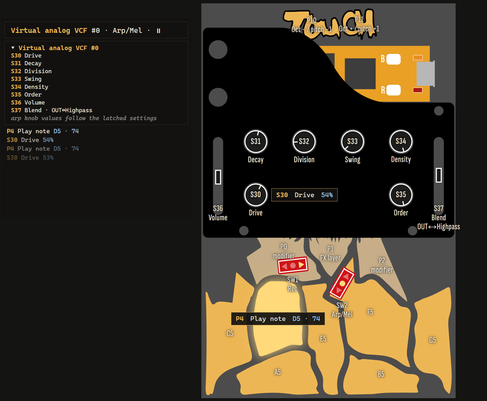
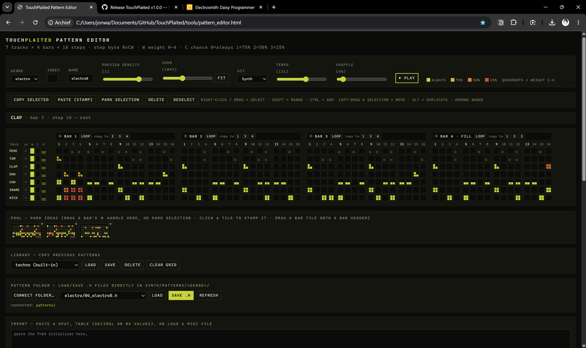

# TouchPlaited

A Synthux Simple Touch firmware based on Mutable Instruments Plaits (Émilie Gillet, MIT License): a 6-voice touch synth plus a 16-step generative drum sequencer, playable at the same time (though limited by voice stealing). All 24 Plaits models are built in (the 16 original + the 8 new ones); 23 are selectable from the panel — Chiptune sits out because its free-running arpeggiator never lands on the knob.



**Full controls reference:** [MANUAL.md](MANUAL.md) — every knob, mode, gesture, MIDI mapping and clock-sync detail lives there. This file is just the front door.

**On the web:** [visualizer](https://jonwaterschoot.github.io/TouchPlaited/visualizer/) · [pattern editor](https://jonwaterschoot.github.io/TouchPlaited/editor/) · [code map](https://jonwaterschoot.github.io/TouchPlaited/codemap/) · [manual](https://jonwaterschoot.github.io/TouchPlaited/manual.html) — hosted from this repo via GitHub Pages.

Note: While playable and pretty stable; I am still working on this, so things might move around.

## What it is

Three playmodes, picked with the right toggle (**SW2**):

- **Basic Pitch** (down) — one model, played with the pads or MIDI in.
- **Arp/Mel** (center) — an arpeggiator (with hold/latch) plus a layered 2-bar note recorder — the arp and the recorder each play their own independent sound.
- **Seq** (up) — a 16-step generative drum sequencer loaded with drum/percussive models, with preloaded patterns per genre.

Six of the seven drums are rolled from per-role pools of engines and parameter ranges. **The kick is not** — it draws from a bank of twelve fixed, numbered kicks, curated by ear rather than generated: the 808 and the 909 as two separate instruments, long pitch sweeps, the bass drum engine's own overdrive, a stacked 909-over-808, and a few from engines never meant to be drums. Step it with **P0 + P10/P11** while the pattern plays; the screen names each one (`K05 909 SWEEP`). See [The kick bank](MANUAL.md#the-kick-bank).

All three can run at once — the drum sequencer and the melodic modes are independent and keep playing across mode switches. A fader (S37) mixes each sound's OUT/AUX outputs.

**MIDI in/out** on USB and on TRS (USART1, D13/D14 — for hardware-modded boards): notes on ch1 (pitched, chromatic) and ch10 (GM drums, laid out as a 4×4 grid and carrying the pattern's own accents as velocity), CC20–31 for sound and sequencer functions plus CC85–88 for the reverb/delay sends, the pads/sequencer mirrored to MIDI out, and full clock sync on both MIDI and CV (S43 in / S40 out) — it follows an external clock (with start/stop) and sends its own when there isn't one.

**Two screens, optional both.** An I2C 128×32 OLED (SSD1306, D11/D12 — see [Hardware mods](MANUAL.md#hardware-mods)) mounts on the faceplate and names whatever you just touched, with its value; it falls back to a per-mode status row when you stop, draws a progress bar for every held gesture, shows a track-and-post display for a knob that's waiting for pickup, and lists what a modifier pad unlocks while you hold it. The [visualizer webapp](https://jonwaterschoot.github.io/TouchPlaited/visualizer/) shows the same telemetry — plus the whole panel, live — on a screen you already have.

## Quick start — your first five minutes

Two toggles, eight knobs, twelve touch pads. **SW2** (right toggle) picks the playmode; **SW1** (left toggle) picks the scale — or the drum genre when sequencing.

```
            [ P10 ] [ P11 ]             ← down / up
        [ P0 ]  [ P1 ]  [ P2 ]          ← control pads
[ P3 ]  [ P4 ]  [ P5 ]  [ P6 ]  [ P7 ]  ← musical pads
            [ P8 ]  [ P9 ]              ← musical pads
```

1. **Start the drums.** Flick **SW2 Up** (Seq mode) — a fresh drum kit is generated and the 16-step sequencer starts playing. Turn **S31** for tempo, **S32** for shuffle, **S33** for density. Flick **SW1** left or right to switch genre (Techno / Electro / IDM); turn **S35** to step through that genre's patterns.
2. **Play drums live.** Tap the musical pads **P3–P9** — kick, snare, closed hat, open hat, clap, tom, perc.
3. **Pick a kick.** Hold **P0** and tap **P11** / **P10** to walk the twelve-strong kick bank while the pattern runs. Deep 808s, sweeping 909s, a stacked one, a pure sine — the screen names each.
4. **Add a synth on top.** Flick **SW2 Down** (Basic Pitch) — the drums keep playing. P3–P9 now play notes; **P10 / P11** shift the octave down / up, and SW1 picks the scale (minor / chromatic / major).
5. **Shape the sound.** **S32** harmonics, **S33** timbre, **S34** morph, **S31** decay, **S30** drive, **S37** OUT↔AUX blend. Choose an engine by holding **P0** (bank 0) or **P2** (bank 1) while turning **S35**.
6. **Let it play itself.** Flick **SW2 Center** (Arp/Mel) and hold a few pads — the arpeggiator plays them. **S32** sets the rate, **S35** the note order, **S34** thins the pattern out. Flick **SW1 left** (Hold) to latch the notes, **SW1 right** (Rec) to hear pads on their own sound without recording yet — hold **P2 then tap P10** to arm, then play to record into a 2-bar loop.
7. **Fine-tune one drum.** In Seq mode, hold any musical pad for 2 s to enter **Recording** — the knobs now edit just that slot. Hold the same pad 1.2 s again to save.
8. **Pause / resume the drums** from any mode: hold **P2**, then tap **P11**. Same for the arp and its loop: **P2**, then **P10**.

> **Tip:** connect the [visualizer](https://jonwaterschoot.github.io/TouchPlaited/visualizer/) over USB MIDI to see every control light up and name itself live while you play.

See [MANUAL.md](MANUAL.md) for the full per-mode knob maps, recording mode, gestures, MIDI mapping, clock sync and LED codes.

## Installing

The firmware runs from QSPI flash (`APP_TYPE = BOOT_QSPI` — it's too big for Daisy's internal SRAM), so the **Daisy bootloader must be on the Seed first**. That's a one-time step per device. Every step below has a no-terminal path (Web Programmer — needs a Chromium-based browser: Chrome, Edge, Brave, Opera; it uses WebUSB, which Firefox and Safari don't support) and a command-line path (`dfu-util`) — pick whichever you're comfortable with; they do the same thing.

### Step 1 — install the Daisy bootloader (once per device)

Connect the Seed over USB and put it in **DFU mode**: hold **BOOT**, tap **RESET**, release **BOOT**.

- **Web Programmer (no terminal needed):** open the [Daisy Web Programmer](https://flash.daisy.audio/) and flash the bootloader.
- **Command line (`dfu-util`):** no need to clone the repo or install a toolchain — just grab the bootloader binary and flash it:
  ```bash
  curl -LO https://raw.githubusercontent.com/Synthux-Academy/libDaisy/62ab175533ce254cb353b60d8651310744b26a40/core/dsy_bootloader_v6_2-intdfu-2000ms.bin
  dfu-util -a 0 -s 0x08000000:leave -D dsy_bootloader_v6_2-intdfu-2000ms.bin -d ,0483:df11
  ```
  (If you've already cloned this repo with submodules — see [Option B](#option-b--build-from-source-with-make) below — you can run `cd lib/libDaisy && make program-boot` instead.)

### Step 2 — flash the app (every time you update)

**Enter the Daisy bootloader:** tap **RESET** (or power up), then press **BOOT** while the LED is doing its slow "breathing" pulse. The bootloader only waits about 2 seconds before launching the app — pressing BOOT during that window makes it wait indefinitely, so you can take your time.

- **Web Programmer:** download `TouchPlaited.bin` from the [releases page](../../releases) and upload it with the [Web Programmer](https://flash.daisy.audio/).
- **Command line:**
  ```bash
  dfu-util -a 0 -s 0x90040000:leave -D TouchPlaited.bin
  ```
  `-D` downloads the file to the device, `-a 0` selects the flash interface, and `-s 0x90040000` is where to write it: the Seed's QSPI flash is memory-mapped at `0x90000000` and the bootloader reserves the first 256 KB (`0x40000`) for itself, so apps live at `0x90000000 + 0x40000`. The `:leave` suffix reboots into the app when the transfer finishes.

> **Two different button dances.** Hold-BOOT-tap-RESET enters the chip's built-in *DFU mode* — used only for installing the bootloader itself (step 1). Tap-RESET-then-BOOT enters the *Daisy bootloader* — used every time you flash the app (step 2).

### Option B — build from source with make

Want to compile the firmware yourself instead of using the release `.bin`? Requires the ARM GNU toolchain (`arm-none-eabi-gcc`), `make`, and Python 3 (the build runs `tools/gen_patterns.py` to register the drum patterns).

```bash
git clone https://github.com/jonwaterschoot/TouchPlaited.git
cd TouchPlaited

# Pull in libDaisy + stmlib
# (the Plaits DSP source is already vendored in thirdparty/plaits/ — nothing to copy)
git submodule update --init --recursive

# Build libDaisy once, then the firmware
cd lib/libDaisy && make && cd ../..
make

# Flash: bootloader once per device, then the app
make program-boot
make program-dfu
```

The build output is `build/TouchPlaited.bin`. See [thirdparty/README.md](thirdparty/README.md) for the full setup details.

## Where everything lives

### Firmware source

| Path | What's there |
|------|---------------|
| [`TouchPlaited.cpp`](TouchPlaited.cpp) | Main firmware entry point — mode/state machine, wires the pieces below together |
| [`synth/`](synth/) | The Plaits voice pool and engine integration, drum sequencer, arp + note recorder, reverb/delay FX, and the QSPI settings journal (auto-save/restore) |
| [`synth/patterns/`](synth/patterns/) | Drum sequencer patterns as headers, one folder per genre (`techno/`, `electro/`, `idm/`) |
| [`synth/kick_presets.h`](synth/kick_presets.h) | The twelve curated kicks, their tweak windows, and the notes on each engine that the numbers came from |
| [`touch/`](touch/) | Drivers for the pads, knobs and toggle switches on the touch controller |
| [`midi/`](midi/) | USB + TRS MIDI I/O (notes, CCs, clock/transport) and the SysEx telemetry the visualizer listens to |
| [`display/`](display/) | On-panel SSD1306 OLED driver and UI (mirrors what the visualizer shows), plus the one-time power-on boot animation |
| [`thirdparty/`](thirdparty/) | Vendored Plaits DSP source + the stmlib and libDaisy-fork submodule setup — see [thirdparty/README.md](thirdparty/README.md) |
| [`lib/`](lib/) | The `libDaisy` submodule (Synthux Academy fork) |

### Tools & web apps

| Path | What's there |
|------|---------------|
| [`tools/pattern_editor.html`](tools/pattern_editor.html) | Browser-based drum pattern editor — see [Drum pattern editor](#drum-pattern-editor) below. Live at [/editor/](https://jonwaterschoot.github.io/TouchPlaited/editor/) |
| [`tools/codemap.html`](tools/codemap.html) | Interactive hardware + memory atlas of the firmware. Live at [/codemap/](https://jonwaterschoot.github.io/TouchPlaited/codemap/) |
| [`tools/gen_patterns.py`](tools/gen_patterns.py) | Build-time script that regenerates the drum pattern registry from the pattern headers |
| [`visualizer/`](visualizer/) | The live-panel visualizer webapp (USB MIDI + SysEx telemetry) — see [visualizer/README.md](visualizer/README.md) and its [PLAN.md](visualizer/PLAN.md). Live at [/visualizer/](https://jonwaterschoot.github.io/TouchPlaited/visualizer/) |
| [`doc/`](doc/) | GitHub Pages site scaffolding — template/theme used to render this README and MANUAL.md into the hosted site |

### Docs

| File | What it's for |
|------|----------------|
| `README.md` | This file — quick overview + project map |
| [`MANUAL.md`](MANUAL.md) | The full controls reference: every mode, knob, gesture, MIDI mapping and the clock-sync spec |
| [`ROADMAP.md`](ROADMAP.md) | Current TODO list / what's being worked on next |
| `notes.md` | Running working log — design decisions and analysis as they happen |
| [`notesarchive/`](notesarchive/) | Archived history once a notes.md/ROADMAP.md era is done — including the [original prompt/plan](notesarchive/Initial-Prompt-plan.md) and the [project's own story](notesarchive/readme.md) |

Other top-level files: `Makefile` (build), `LICENSE` / `licenseinfo.md` (this project's MIT license plus third-party attributions), `img/` (screenshots and panel artwork used across the docs).

## Drum pattern editor

The drum sequencer's genre patterns are plain headers in [synth/patterns/](synth/patterns/) (one folder per genre: `techno/`, `electro/`, `idm/`). [tools/pattern_editor.html](tools/pattern_editor.html) is a browser-based editor for making them — open it directly in a browser, no server needed, to draw steps on the 16-step grid with four per-step chance levels (always / 75% / 50% / 25% — these interact with the Density knob) and audition the pattern with the live preview. Editing itself needs nothing but a browser; it's turning the exported `.h` file into a pattern the hardware can play that needs Python 3 and the rest of the [build-from-source toolchain](#option-b--build-from-source-with-make) — drop the file into the right genre folder and run `make`, which calls `tools/gen_patterns.py` to regenerate the pattern registry. The new pattern then shows up under S35 for its genre in Seq mode.



**Connect folder…** (Chrome/Edge, via the File System Access API) links the editor straight to your `synth/patterns/` folder so **Load** and **Save .h** read and write the genre subfolders directly — no manual copy/paste or re-picking a save location each time. The folder reference itself isn't stored in the repo or any config file: it's a handle kept in that browser profile's IndexedDB, so it's local to the machine/browser you connected from. Permission can lapse (e.g. after a browser restart); if it does, one click on **Connect folder…** re-authorizes the same remembered folder instead of making you browse for it again. Browsers without the API fall back to the copy/paste export.

I built this editor because hand-writing 64-byte step/velocity arrays in a header file is exactly the kind of tedium that turns into typos — a visual grid with instant audio feedback is a much shorter loop from "I want this pattern" to hearing it on the sequencer.

## Settings memory

The firmware remembers where you left it: power-cycle the Simple Touch and it comes back with the same engine, per-mode volumes/drives/blends, FX sends, seq settings and genre, octaves and root, the drum kit, the Basic Pitch randomize snapshots, and the arp's and Rec's independent sounds. There is no save button — a few seconds after you stop changing things, the state is written automatically. Not saved on purpose: whatever a physical switch dictates at boot (SW2 playmode, SW1 scale position), transport states, and the note recorder's loop content (that's a take, not a setting). Restored values follow the same pickup doctrine as everything else here: a pot doesn't take over until it crosses the value it's holding, so knobs sitting in arbitrary positions at power-on never stomp the restored sound.

How it works under the hood is worth a note, because the obvious approach doesn't work on this build. The Daisy Seed's persistent storage is its 8 MB QSPI NOR flash — but this firmware *executes* from that same chip (`APP_TYPE = BOOT_QSPI`; the binary outgrew the SRAM boot option long ago). Writing to the flash requires taking it out of memory-mapped mode, and from that instant the CPU can no longer fetch instructions from it — which is why libDaisy's `PersistentStorage` simply refuses to run from QSPI. The workaround ([synth/settings_journal.cpp](synth/settings_journal.cpp)) is a small register-level program/erase routine placed in a `.data` section: it gets copied to SRAM at startup like any initialized data, runs entirely from there with interrupts masked, talks straight to the QUADSPI peripheral (including releasing and re-entering the flash's continuous-read XIP latch), and restores memory-mapped mode before returning — a window of about a millisecond that the audio interrupt simply waits out, well inside its 4 ms block budget, so playback, MIDI and clock stay in sync.

The other half is never needing the *slow* flash operation while audio runs. NOR flash can write bytes at any time but only erase in 4 KB sectors, and an erase blocks for 45–300 ms — an audible dropout. So settings live in an append-only journal in 64 KB near the top of flash (two 32 KB banks, far above the app image — but deliberately *not* against the very end of the chip: memory-mapped reads that touch the last bytes of the QSPI window trip an STM32H7 prefetch erratum and hard-fault, a lesson this project learned as a boot freeze, so the journal sits below a 64 KB guard band at a base derived from the controller's actual mapped size). Every save appends one fresh 512-byte CRC-checked record into already-erased space, one 256-byte page per main-loop pass, and skipped whenever the audio CPU is near its budget. Erasing only happens at boot, before audio starts, to reclaim the bank the journal has moved out of. On boot the newest valid record wins; a save torn by a power cut just fails its CRC and the previous one loads instead. Wear is a non-issue by construction: a sector is erased once per 128 saves, so at 100k rated cycles the journal outlives the hardware by a few orders of magnitude.

## About this project

TouchPlaited was built almost entirely by prompting: I can't write full C++ firmware myself, but years of making Simple Touch firmwares (mostly with Plugdata/HVCC) taught me how I want an instrument to *feel* — so I supplied the UI/UX thinking and the hardware knowledge, and let Claude (in VSCode, via the Claude Code extension) do the engineering.

The approach was deliberate rather than freewheeling:

1. **Start with a written brief.** A short prompt describing the goal, the hardware, and the reference codebases went in first — kept as [notesarchive/Initial-Prompt-plan.md](notesarchive/Initial-Prompt-plan.md).
2. **Demand a plan with decision gates.** Claude turned it into a phased [implementation plan](notesarchive/plan_archive.md) with explicit VERIFY blocks — design choices I had to answer myself before any code got written.
3. **Iterate with a paper trail.** From there it was a loop of implement → test on hardware → feed findings back. Decisions and analyses accumulate in [notes.md](notes.md), future work lives in [ROADMAP.md](ROADMAP.md), and each finished era gets archived instead of deleted — the completed v1 steps are in [notesarchive/roadmap_v1_archive.md](notesarchive/roadmap_v1_archive.md).

The full story — the original prompt, the plan, and a timeline from the first commit to the first stable version — is in [notesarchive/readme.md](notesarchive/readme.md). If you're curious what a mainly prompt-driven firmware project actually looks like end to end, that folder is the honest record.

### Thanks & credits

- **Émilie Gillet / Mutable Instruments** — [Plaits](https://github.com/pichenettes/eurorack/tree/master/plaits) and [stmlib](https://github.com/pichenettes/stmlib), the heart of this firmware (MIT License). Also the excellent [documentation](https://pichenettes.github.io/mutable-instruments-documentation/modules/plaits/).
- **shakfu** — [sk-engines](https://github.com/shakfu/sk-engines) and its [mosc](https://github.com/shakfu/sk-engines/blob/0.5.1/docs/engines/mosc.md) firmware, which put Plaits on Spotkach (also Daisy powered) first and gave me the inspiration to build this.
- **Vlad (Bleeptools) / Synthux Academy** — the [TouchBass](https://github.com/Synthux-Academy/TouchBass) repo was the base template this project grew from, and the [Simple Touch](https://synthux.academy/) itself is the platform that makes tinkering like this so approachable (including their [libDaisy fork](https://github.com/Synthux-Academy/libDaisy) used as the submodule here).
- **Electrosmith** — the [Daisy Seed](https://electro-smith.com/) and [libDaisy](https://github.com/electro-smith/libDaisy), the hardware and library everything runs on.
- **Anthropic's Claude** — wrote the C++ under my direction; see the workflow story above.
