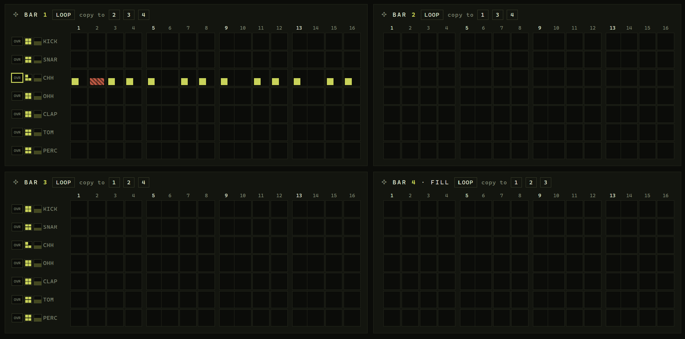

In the editor: 

- ordering of tracks. Reorder so that Kick drum is the bottom track, this follows the way most daws do this when in a pianoroll view

- the blocks gui is not ideal:
  - when breaking the amount of blocks the editor buttons and labels are fixed on theat block, after changing zoomm this can create three blocks in one row, where the first and last  one have the labels and buttons.
  - needs a better logic 

  - we should try to find a middle ground between how DAWS work, where the pianoroll has an automation row below and an options sidebar on the left

  - I want to keep the option to have the easy split of 4 blocks, and the option to park ideas in the pool.
  - but a pianoroll doas make for an easier and more condense table.
  - overhauling our current method of options per track before each bar may be smarter. 

Visual tweaks cell sizes:

- collumns 5, 9 and 13 are overlapping with the next collumns

## editing full rows:

- the density slider block is adding to each cell, the behaviour should be to only affect the filled cells
- the chance slider is also randomizing the content of each cell
- random is ok, but 
- in front of each block, or perhaps per cell, we could set a lock icon, this allows to override the chance and density
the lock has three stages: free, position locked, density/chance locked

## select copy paste behaviour

- select, copy, drag we could use a method where we make selecting and moving copying via a right click, or by having a toggle / tool option that changes behaviour from edit to select: we want soluttions for typical drag, copy and paste behaviour, alt drag to duplicate, etc ... in this case a right click could be easier to use as a paste command.

Distill from these interactions:
  - use the right mouse click to allow selecting with a click or drag to select multiple. with single clicks shift and ctrl do the 'common' thing, shift select all between clicked, ctrl select multiple individual
  - with left click, a selection is now draggable (clicking it does nothing, to avoid conflict with normal behaviour of filling the cell)
  - after a selection has been made allow copying with a button on top ("copy selected") or ctrl+c
  - normal dragging moves selection (across cells, allows to 'bridge to next block)
  - left and right arrows also work to move
  - right click allows to   
